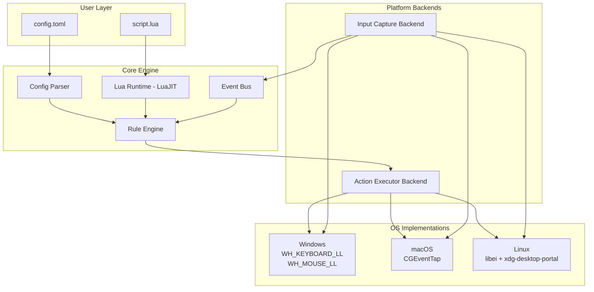
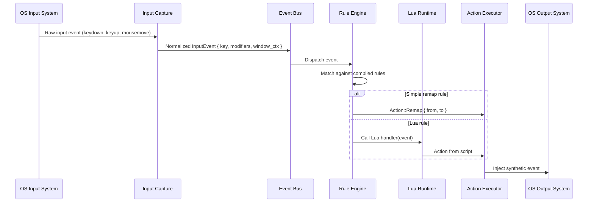
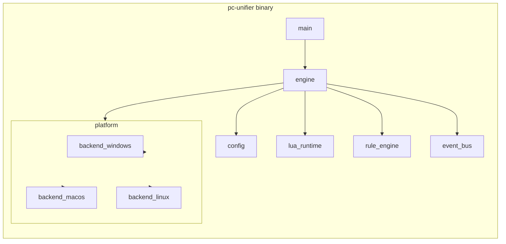
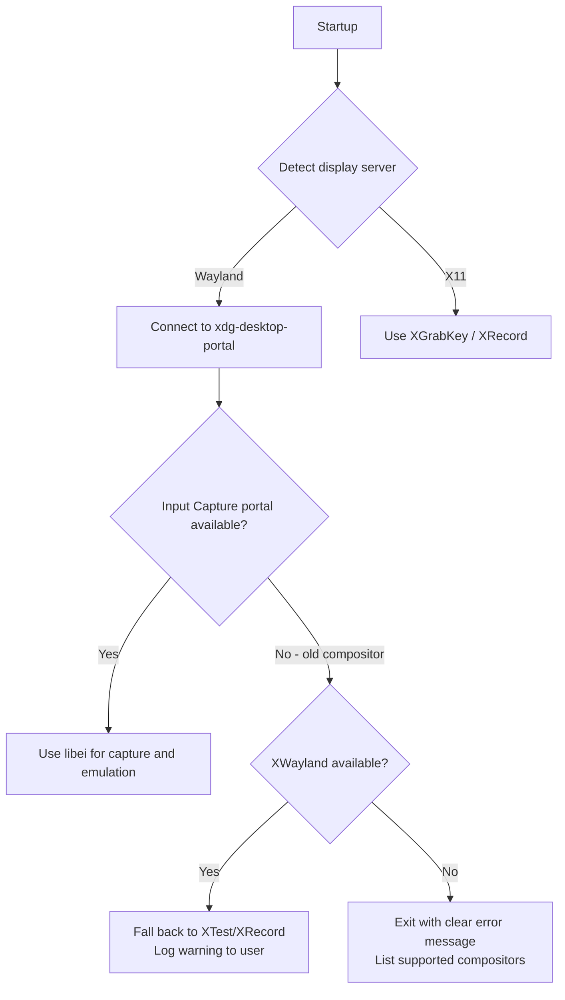

# PC Unifier - Architecture

## Overview

PC Unifier is a cross-platform input automation engine. It captures keyboard and mouse
input at the OS level, matches events against user-defined rules, and executes actions
in response. Rules are defined in a TOML config file for simple cases and Lua scripts
for complex logic.

**Design principles:**

- Input capture and action execution must never exceed 33ms (30fps budget)
- Each OS backend is a first-class implementation, not a compatibility shim
- Config-first for simple use cases, Lua scripting for complex ones
- A single self-contained binary per platform. No runtime dependencies

---

## System Architecture



---

## Event Lifecycle



---

## Module Structure



| Crate / Module | Responsibility |
|---|---|
| `main` | Entry point, daemon lifecycle, signal handling |
| `engine` | Orchestrates all subsystems |
| `config` | Parse and validate `config.toml` |
| `lua_runtime` | Embed LuaJIT via `mlua`, expose PC Unifier API to scripts |
| `rule_engine` | Match normalized events against compiled rules, route to actions |
| `event_bus` | Internal async channel between capture and rule engine |
| `platform` | Trait definitions for `InputCapture` and `ActionExecutor` |
| `platform::windows` | `WH_KEYBOARD_LL`, `WH_MOUSE_LL`, `SendInput` |
| `platform::macos` | `CGEventTap`, `CGEventPost`, Accessibility permission check |
| `platform::linux` | `libei`, `xdg-desktop-portal`, XWayland fallback detection |

---

## Platform Backends

### Linux

Linux is the most complex backend due to the Wayland transition.



**Minimum compositor support for full Wayland path:**

| Compositor | Minimum Version |
|---|---|
| KDE Plasma (KWin) | 5.27 |
| GNOME (Mutter) | 44 |
| Sway | 1.8 |
| Hyprland | 0.34 |

### macOS

CGEventTap requires Accessibility permission. On first run, PC Unifier will detect
missing permission, print a clear message directing the user to System Settings, and
exit gracefully. It does not attempt to run without the permission.

### Windows

No special permissions required for `WH_KEYBOARD_LL`. The daemon runs as a standard
user process.

---

## Config Schema (v1)

The TOML config is the primary interface for non-developers.

```toml
# ~/.config/pc-unifier/config.toml  (Linux)
# ~/Library/Application Support/pc-unifier/config.toml  (macOS)
# %APPDATA%\pc-unifier\config.toml  (Windows)

# Remap a key globally
[[remap]]
from = "Meta"
to   = "Ctrl"

# Remap only in a specific application
[[remap]]
from = "Meta"
to   = "Ctrl"
apps = ["org.mozilla.firefox"]    # WM_CLASS on Linux, bundle ID on macOS, exe name on Windows. Accepts multiple.

# Hotkey: trigger a shell command
[[hotkey]]
keys    = ["Ctrl", "Alt", "T"]
action  = "exec"
command = "kitty"

# Hotstring: text expansion
[[hotstring]]
trigger     = ";;email"
replacement = "myemail@example.com"

# Load a Lua script for complex logic
[[script]]
path = "~/.config/pc-unifier/scripts/my_macros.lua"
```

---

## Lua API Surface (v1)

Scripts receive normalized events and return actions. The API is intentionally small.

```lua
-- Register a hotkey handler
pcunifier.on_hotkey({"Ctrl", "Shift", "R"}, function(event)
    pcunifier.exec("notify-send 'Reloaded'")
end)

-- Register a key remap
pcunifier.remap("Meta", "Ctrl")

-- Register a hotstring
pcunifier.hotstring(";;name", "Jane Doe")

-- Query the focused window
local win = pcunifier.focused_window()
-- win.app_id, win.title

-- Conditionally remap based on focused app
pcunifier.on_key("Meta", function(event)
    if pcunifier.focused_window().app_id == "org.mozilla.firefox" then
        return pcunifier.action.remap("Ctrl")
    end
    return pcunifier.action.passthrough()
end)
```

---

## Performance Budget

| Stage | Budget | Notes |
|---|---|---|
| OS event to Event Bus | < 1ms | Direct callback, no allocation |
| Rule Engine match | < 2ms | Compiled rule table, O(n) scan for v1 |
| Lua handler execution | < 5ms | LuaJIT, no I/O in hot path |
| Action injection | < 5ms | OS syscall |
| **Total end-to-end** | **< 33ms** | 30fps floor, target is well under |

---

## v1 Scope

| Feature | Status |
|---|---|
| Key remapping (global) | v1 |
| Key remapping (per-app) | v1 |
| Hotkeys | v1 |
| Hotstrings | v1 |
| Lua scripting | v1 |
| Window context query | v1 |
| System tray | v2 |
| GUI config editor | v2 |
| Package manager distribution | v2 |

---

## Repository Layout

```
PC-Unifier/
├── README.md
├── Cargo.toml                  # Workspace root
├── docs/
│   ├── architecture.md         # This document
│   ├── roadmap.md
│   └── config-schema.md
├── src/
│   ├── main.rs
│   ├── engine/
│   ├── config/
│   ├── lua_runtime/
│   ├── rule_engine/
│   ├── event_bus/
│   └── platform/
│       ├── mod.rs              # InputCapture + ActionExecutor traits
│       ├── windows/
│       ├── macos/
│       └── linux/
└── .github/
    └── workflows/
        └── ci.yml
```
