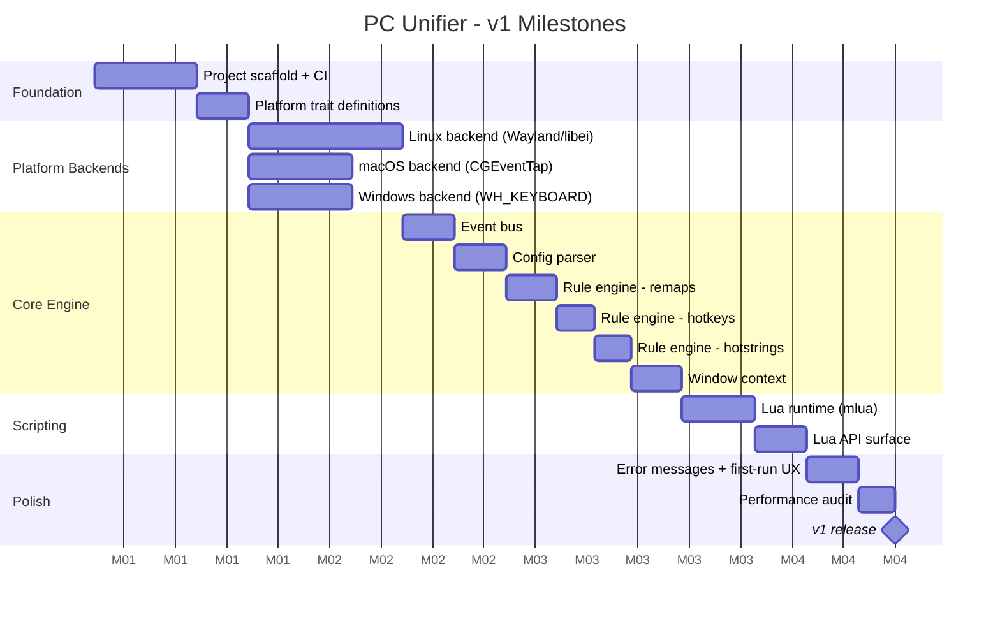

# PC Unifier - Roadmap

## Guiding Principles

- Each milestone must be fully working before the next begins
- Platform backends are built in parallel tracks, not sequentially
- Performance benchmarks are a hard gate at each milestone, not a post-release concern
- No GUI until the core engine is stable

---

## Milestone Overview



---

## Milestone Detail

### M1 - Project Scaffold and CI

**Goal:** Empty but buildable repo. CI passes on all three OS targets.

Deliverables:
- Cargo workspace with all crate stubs
- GitHub Actions CI: build + test on `ubuntu-latest`, `macos-latest`, `windows-latest`
- `cargo clippy` and `cargo fmt` enforced in CI
- `README.md` with build instructions

Gate: `cargo build --release` produces a binary on all three platforms.

---

### M2 - Platform Trait Definitions

**Goal:** Define the contracts that all three backends must fulfill. No implementations yet.

```
platform/mod.rs
  trait InputCapture   { fn start(...) }
  trait ActionExecutor { fn execute(...) }

  enum InputEvent { KeyDown, KeyUp, MouseMove, ... }
  enum Action     { Remap, Exec, TypeString, Passthrough, Suppress }
```

Gate: Traits compile. Unit tests assert the type signatures are correct.

---

### M3 - Linux Backend (Wayland)

**Goal:** Capture a keypress and re-emit it on a real Wayland compositor.

Sequence:
1. Connect to `xdg-desktop-portal` Input Capture portal
2. Receive raw input via `libei`
3. Emit a synthetic keypress via `libei` emulation
4. XWayland fallback detection (warn, do not error)

Gate: Manual test. Press a key, see it re-emitted. Latency measured under 10ms.

---

### M4 - macOS Backend

**Goal:** Capture a keypress and re-emit it via `CGEventTap`.

Sequence:
1. Check Accessibility permission on startup. Exit gracefully if missing.
2. Install `CGEventTap` for keyboard and mouse events
3. Re-emit synthetic event via `CGEventPost`

Gate: Same as M3. Manual latency test.

---

### M5 - Windows Backend

**Goal:** Capture a keypress and re-emit it via `WH_KEYBOARD_LL`.

Sequence:
1. Install low-level keyboard hook via `SetWindowsHookEx`
2. Process in a dedicated message loop thread
3. Re-emit via `SendInput`

Gate: Same as M3. Manual latency test.

---

### M6 - Event Bus

**Goal:** Async channel connecting input capture to the rule engine.

- Tokio `mpsc` channel
- `InputEvent` is the message type
- Backpressure strategy defined (drop oldest vs block)

Gate: Unit test sends 10,000 events through the bus. No drops. Measured throughput logged.

---

### M7 - Config Parser

**Goal:** Parse `config.toml` into typed Rust structs. Validate on load.

- Uses `serde` + `toml` crate
- Clear error messages for malformed config (line number, field name, expected type)
- Config file path resolved per OS convention

Gate: Unit tests cover valid configs, missing fields, wrong types, unknown keys.

---

### M8 - Rule Engine: Remaps

**Goal:** `[[remap]]` entries in config produce working key remaps.

- Global remaps
- Per-app remaps (requires window context stub returning `None` until M11)
- Remap table compiled at startup, not re-parsed per event

Gate: Integration test. Config remaps `A` to `B`. Synthesized `A` event produces `B` action.

---

### M9 - Rule Engine: Hotkeys

**Goal:** `[[hotkey]]` entries trigger `exec` actions.

- Modifier + key combos
- Chord detection with configurable timeout
- `exec` spawns a subprocess, non-blocking

Gate: Integration test. `Ctrl+Alt+T` triggers a command. Verified via mock executor.

---

### M10 - Rule Engine: Hotstrings

**Goal:** `[[hotstring]]` entries expand typed sequences.

- Track a rolling input buffer
- On trigger match, suppress trigger keystrokes and inject replacement string
- Configurable trigger delimiter (default: none, expansion on full match)

Gate: Integration test. Type `;;email`, output is `myemail@example.com`.

---

### M11 - Window Context

**Goal:** Rule engine can query the currently focused application.

| OS | API |
|---|---|
| Linux (Wayland) | `xdg-desktop-portal` or compositor-specific (KWin scripting, ext-foreign-toplevel) |
| macOS | `NSWorkspace.shared.frontmostApplication` |
| Windows | `GetForegroundWindow` + `GetWindowThreadProcessId` |

Gate: Unit test mocks focused window. Per-app remap rule activates only when app matches.

---

### M12 - Lua Runtime

**Goal:** Embed `mlua` with LuaJIT. Load and execute a script file.

- Script loaded at startup alongside config
- Lua errors are caught, logged, and do not crash the daemon
- Hot-reload on `SIGHUP` (Linux/macOS) or config file watcher (Windows)

Gate: Load a Lua script that calls `print("hello")`. Verify output in daemon log.

---

### M13 - Lua API Surface

**Goal:** Full v1 Lua API available to scripts.

| Function | Behavior |
|---|---|
| `pcunifier.remap(from, to)` | Register a remap |
| `pcunifier.on_hotkey(keys, fn)` | Register a hotkey handler |
| `pcunifier.hotstring(trigger, replacement)` | Register a hotstring |
| `pcunifier.on_key(key, fn)` | Register a raw key handler |
| `pcunifier.focused_window()` | Return `{ app_id, title }` |
| `pcunifier.exec(command)` | Spawn subprocess |
| `pcunifier.action.remap(key)` | Return a remap action from a handler |
| `pcunifier.action.passthrough()` | Return a passthrough action |
| `pcunifier.action.suppress()` | Suppress the event |

Gate: Integration test exercises every API function via a test script.

---

### M14 - Error Messages and First-Run UX

**Goal:** A new user on any OS gets clear, actionable output when something is wrong.

Scenarios covered:
- macOS: Accessibility permission missing
- Linux: Compositor does not support Input Capture portal
- Config: Syntax error, unknown key, invalid value
- Script: Lua syntax error, runtime error in handler
- Binary: Run as root (warn, do not require)

Gate: Manual walkthrough of each error scenario on each OS. Output reviewed for clarity.

---

### M15 - Performance Audit

**Goal:** Measure and document actual end-to-end latency before release.

- Benchmark harness injects synthetic events and measures time to action execution
- Results compared against the 33ms budget defined in architecture.md
- Any stage exceeding its budget is profiled and optimized before release

Gate: All stages within budget. Benchmark results committed to `docs/benchmarks.md`.

---

## v2 Scope (Not Scheduled)

| Feature | Notes |
|---|---|
| System tray icon | Per-OS native tray. Toggle daemon on/off. |
| GUI config editor | Visual rule builder. No TOML required. |
| Homebrew tap | `brew install pc-unifier` |
| winget manifest | `winget install pc-unifier` |
| AUR PKGBUILD | Arch/Manjaro support |
| Flatpak | Universal Linux packaging |
| Plugin API | Third-party Lua libraries |
| Mouse support | Remap mouse buttons, gestures |
| Macro recording | Record and replay input sequences |
