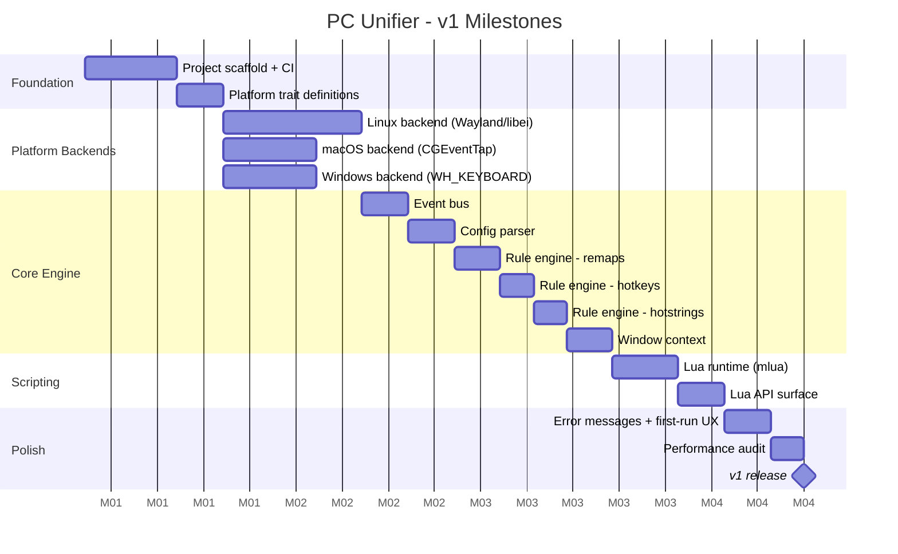

# PC Unifier - Roadmap

## Guiding Principles

- Each milestone must be fully working before the next begins
- Platform backends are built in parallel tracks, not sequentially
- Performance benchmarks are a hard gate at each milestone, not a post-release concern
- No GUI until the core engine is stable

---

## Milestone Overview



---

## Milestone Detail

### M1 - Project Scaffold and CI

**Goal:** Empty but buildable repo. CI passes on all three OS targets.

Deliverables:
- Cargo workspace with all crate stubs
- GitHub Actions CI: build + test on `ubuntu-latest`, `macos-latest`, `windows-latest`
- `cargo clippy` and `cargo fmt` enforced in CI
- `README.md` with build instructions

Gate: `cargo build --release` produces a binary on all three platforms.

---

### M2 - Platform Trait Definitions

**Goal:** Define the contracts that all three backends must fulfill. No implementations yet.

```
platform/mod.rs
  trait InputCapture   { fn start(...) }
  trait ActionExecutor { fn execute(...) }

  enum InputEvent { KeyDown, KeyUp, MouseMove, ... }
  enum Action     { Remap, Exec, TypeString, Passthrough, Suppress }
```

Gate: Traits compile. Unit tests assert the type signatures are correct.

---

### M3 - Linux Backend (Wayland)

**Goal:** Capture a keypress and re-emit it on a real Wayland compositor.

Sequence:
1. Connect to `xdg-desktop-portal` Input Capture portal
2. Receive raw input via `libei`
3. Emit a synthetic keypress via `libei` emulation
4. XWayland fallback detection (warn, do not error)

Gate: Manual test. Press a key, see it re-emitted. Latency measured under 10ms.

---

### M4 - macOS Backend

**Goal:** Capture a keypress and re-emit it via `CGEventTap`.

Sequence:
1. Check Accessibility permission on startup. Exit gracefully if missing.
2. Install `CGEventTap` for keyboard and mouse events
3. Re-emit synthetic event via `CGEventPost`

Gate: Same as M3. Manual latency test.

---

### M5 - Windows Backend

**Goal:** Capture a keypress and re-emit it via `WH_KEYBOARD_LL`.

Sequence:
1. Install low-level keyboard hook via `SetWindowsHookEx`
2. Process in a dedicated message loop thread
3. Re-emit via `SendInput`

Gate: Same as M3. Manual latency test.

---

### M6 - Event Bus

**Goal:** Async channel connecting input capture to the rule engine.

- Tokio `mpsc` channel
- `InputEvent` is the message type
- Backpressure strategy defined (drop oldest vs block)

Gate: Unit test sends 10,000 events through the bus. No drops. Measured throughput logged.

---

### M7 - Config Parser

**Goal:** Parse `config.toml` into typed Rust structs. Validate on load.

- Uses `serde` + `toml` crate
- Clear error messages for malformed config (line number, field name, expected type)
- Config file path resolved per OS convention

Gate: Unit tests cover valid configs, missing fields, wrong types, unknown keys.

---

### M8 - Rule Engine: Remaps

**Goal:** `[[remap]]` entries in config produce working key remaps.

- Global remaps
- Per-app remaps (requires window context stub returning `None` until M11)
- Remap table compiled at startup, not re-parsed per event

Gate: Integration test. Config remaps `A` to `B`. Synthesized `A` event produces `B` action.

---

### M9 - Rule Engine: Hotkeys

**Goal:** `[[hotkey]]` entries trigger `exec` actions.

- Modifier + key combos
- Chord detection with configurable timeout
- `exec` spawns a subprocess, non-blocking

Gate: Integration test. `Ctrl+Alt+T` triggers a command. Verified via mock executor.

---

### M10 - Rule Engine: Hotstrings

**Goal:** `[[hotstring]]` entries expand typed sequences.

- Track a rolling input buffer
- On trigger match, suppress trigger keystrokes and inject replacement string
- Configurable trigger delimiter (default: none, expansion on full match)

Gate: Integration test. Type `;;email`, output is `myemail@example.com`.

---

### M11 - Window Context

**Goal:** Rule engine can query the currently focused application.

| OS | API |
|---|---|
| Linux (Wayland) | `xdg-desktop-portal` or compositor-specific (KWin scripting, ext-foreign-toplevel) |
| macOS | `NSWorkspace.shared.frontmostApplication` |
| Windows | `GetForegroundWindow` + `GetWindowThreadProcessId` |

Gate: Unit test mocks focused window. Per-app remap rule activates only when app matches.

---

### M12 - Lua Runtime

**Goal:** Embed `mlua` with LuaJIT. Load and execute a script file.

- Script loaded at startup alongside config
- Lua errors are caught, logged, and do not crash the daemon
- Hot-reload on `SIGHUP` (Linux/macOS) or config file watcher (Windows)

Gate: Load a Lua script that calls `print("hello")`. Verify output in daemon log.

---

### M13 - Lua API Surface

**Goal:** Full v1 Lua API available to scripts.

| Function | Behavior |
|---|---|
| `pcunifier.remap(from, to)` | Register a remap |
| `pcunifier.on_hotkey(keys, fn)` | Register a hotkey handler |
| `pcunifier.hotstring(trigger, replacement)` | Register a hotstring |
| `pcunifier.on_key(key, fn)` | Register a raw key handler |
| `pcunifier.focused_window()` | Return `{ app_id, title }` |
| `pcunifier.exec(command)` | Spawn subprocess |
| `pcunifier.action.remap(key)` | Return a remap action from a handler |
| `pcunifier.action.passthrough()` | Return a passthrough action |
| `pcunifier.action.suppress()` | Suppress the event |

Gate: Integration test exercises every API function via a test script.

---

### M14 - Error Messages and First-Run UX

**Goal:** A new user on any OS gets clear, actionable output when something is wrong.

Scenarios covered:
- macOS: Accessibility permission missing
- Linux: Compositor does not support Input Capture portal
- Config: Syntax error, unknown key, invalid value
- Script: Lua syntax error, runtime error in handler
- Binary: Run as root (warn, do not require)

Gate: Manual walkthrough of each error scenario on each OS. Output reviewed for clarity.

---

### M15 - Performance Audit

**Goal:** Measure and document actual end-to-end latency before release.

- Benchmark harness injects synthetic events and measures time to action execution
- Results compared against the 33ms budget defined in architecture.md
- Any stage exceeding its budget is profiled and optimized before release

Gate: All stages within budget. Benchmark results committed to `docs/benchmarks.md`.

---

## v2 Scope (Not Scheduled)

| Priority | Feature | Notes |
|---|---|---|
| 1 | Window management | Minimize, maximize, move, resize, next monitor, next workspace. Lua API. See detail below. |
| 2 | Mouse support | Remap mouse buttons, gestures |
| 3 | Macro recording | Record and replay input sequences |
| 4 | System tray icon | Per-OS native tray. Toggle daemon on/off. |
| 5 | GUI config editor | Visual rule builder. No TOML required. |
| 6 | Plugin API | Third-party Lua libraries |
| 7 | Homebrew tap | `brew install pc-unifier` |
| 7 | winget manifest | `winget install pc-unifier` |
| 7 | AUR PKGBUILD | Arch/Manjaro support |
| 7 | Flatpak | Universal Linux packaging |

---

## V2 Priority 1: Window Management

### Goal

Expose a unified Lua API for common window operations so that any hotkey can
trigger a window action without the user writing platform-specific code. The
canonical use case:

```toml
# config.toml -- no Lua required for simple cases
[[hotkey]]
keys    = ["Ctrl", "Alt", "PageDown"]
action  = "exec"
command = "lua:window.minimize()"
```

```lua
-- macros.lua -- full control via Lua
pcunifier.on_hotkey({"Ctrl", "Alt", "PageDown"}, function()
    pcunifier.window.minimize()
end)

pcunifier.on_hotkey({"Ctrl", "Alt", "Right"}, function()
    pcunifier.window.move_to_next_monitor()
end)
```

### Operations

| Operation | Description |
|---|---|
| `window.minimize()` | Minimize the active window |
| `window.maximize()` | Maximize (or zoom) the active window |
| `window.restore()` | Restore a minimized or maximized window to its normal size |
| `window.move(x, y)` | Move the active window to an absolute screen position |
| `window.resize(w, h)` | Resize the active window |
| `window.move_to_next_monitor()` | Move the active window to the next monitor, preserving relative position |
| `window.move_to_next_workspace()` | Move the active window to the next virtual desktop / workspace |
| `window.get_info()` | Return `{ title, app_id, x, y, width, height, monitor, workspace }` |

### Platform Implementation Strategies

| OS | Get active window | Minimize / Maximize | Move / Resize | Next monitor | Next workspace |
|---|---|---|---|---|---|
| Windows | `GetForegroundWindow()` | `SendMessage(hwnd, WM_SYSCOMMAND, SC_MINIMIZE / SC_MAXIMIZE, 0)` | `SetWindowPos(hwnd, ...)` | `MonitorFromWindow` + `GetMonitorInfo` + `SetWindowPos` | `IVirtualDesktopManager` COM interface (Windows 10+) |
| macOS | `AXUIElement` (Accessibility permission -- already granted from M4) | `AXUIElementSetAttributeValue(kAXMinimizedAttribute / kAXZoomedAttribute, true)` | `AXUIElementSetAttributeValue(kAXPositionAttribute / kAXSizeAttribute, ...)` | Enumerate `NSScreen.screens`, compute target, AX move | No public API. AppleScript via `System Events` is the fallback; fragile but functional for common compositors |
| Linux (Wayland) | Compositor-specific -- see below | Compositor-specific | Compositor-specific | Compositor-specific | Compositor-specific |

#### Linux Wayland: the hard case

Wayland was deliberately designed so that external processes cannot manage
windows. This is a security feature of the protocol. As a result, window
management APIs are compositor-specific and there is no universal standard.

The engine will need a compositor-detection layer (analogous to the evdev vs.
portal detection in M3) and a per-compositor backend:

| Compositor | Window management path | Coverage |
|---|---|---|
| KDE Plasma / KWin | `org.kde.KWin` D-Bus scripting API. Rich and stable. | Full: minimize, maximize, move, resize, virtual desktops |
| GNOME Shell | `org.gnome.Shell` D-Bus. `Eval` is restricted in GNOME 45+; a GNOME Shell extension is the reliable path for move/resize. | Partial: minimize/close via D-Bus, move/resize requires extension |
| wlroots compositors (Sway, Hyprland, Wayfire) | `wlr-foreign-toplevel-management-unstable-v1` Wayland protocol. Covers activate, minimize, maximize, close. Move/resize not in protocol. | Partial: state changes only; geometry requires compositor IPC (e.g. Hyprland socket, Sway IPC) |
| `xdg-desktop-portal` WindowManagement | In development; not stable or widely implemented as of 2025. Track for future adoption. | Future |
| XWayland fallback | If XWayland is running, `xdotool` or direct EWMH (`_NET_WM_STATE`) may work as a last resort. | Partial, X11 windows only |

**Recommended implementation order:** KWin first (most capable API), then
wlroots (wide compositor coverage), then GNOME Shell (extension dependency is
a hard constraint to document clearly for users).

### Architecture: Rust backend + Lua surface

The Rust side implements a `WindowManager` trait with per-platform structs
(mirroring `InputCapture` and `ActionExecutor`). The Lua layer (M13+) binds
the trait methods into `pcunifier.window.*`.

```
Action::WindowOp { op: WindowOp }
    |
    v
WindowManager::execute(op)   -- platform trait
    |
    +-- WindowsWindowManager   (Win32)
    +-- MacOSWindowManager     (AXUIElement)
    +-- LinuxWindowManager     (compositor backend registry)
            |
            +-- KWinBackend
            +-- WlrForeignToplevelBackend
            +-- GnomeShellBackend
```

The `LinuxWindowManager` detects the compositor at startup (via D-Bus service
name presence or environment variables) and selects the appropriate backend,
logging which one was chosen. If no supported compositor is detected, window
operations log a warning and return an error that surfaces in Lua as an
exception.

### Planned V2 Milestones

| Milestone | Scope |
|---|---|
| V2M1 | `WindowManager` trait + Windows implementation. Lua API stubs on all platforms. Gate: `Ctrl+Alt+PageDown` minimizes the active window on Windows. |
| V2M2 | macOS implementation via `AXUIElement`. Gate: same hotkey minimizes on macOS. |
| V2M3 | Linux: KWin backend. Gate: minimize/maximize/move via D-Bus on KDE. |
| V2M4 | Linux: wlroots backend (`wlr-foreign-toplevel-management`). Gate: minimize on Sway and Hyprland. |
| V2M5 | Multi-monitor (`move_to_next_monitor`) on all platforms. Gate: window moves cleanly between two physical monitors on each OS. |
| V2M6 | Multi-workspace (`move_to_next_workspace`) on Windows and KDE. GNOME and wlroots compositors documented as known limitations. |

---

## Security Considerations (v2)

The `exec` action and the planned Lua `pcunifier.exec()` API create a direct path from
a physical key event to an arbitrary shell command running as the daemon user. The items
below track the work needed to make that path defensible.

### Attack surface

The config file is the primary trust boundary. Any process or user that can write to
`config.toml` can inject arbitrary commands that execute at the daemon's privilege level.
On Linux the daemon holds the `input` group; on macOS it holds Accessibility permission;
on Windows it holds a system-wide keyboard hook. None of these are root-equivalent, but
all are elevated relative to a normal user process, and all represent capabilities an
attacker would want.

The Lua scripting layer (M12/M13) widens the surface further: a compromised or malicious
script file gains access to the full `pcunifier.exec()` API.

### Planned mitigations

| Item | Description |
|---|---|
| Config file permission enforcement | Refuse to load `config.toml` if it is world-writable or owned by a different user. Log a clear error and exit. |
| Exec audit log | Record every spawned command: timestamp, PID, invoking hotkey, and exit code (async, best-effort). Written to the system journal or a dedicated log file. |
| Exec allowlist (opt-in) | Optional `[security]` config section that restricts `exec` to a predefined set of command prefixes. Daemon refuses to spawn anything not on the list. |
| Lua sandbox restrictions | Restrict the Lua runtime so scripts cannot perform arbitrary file I/O or network calls without explicit user opt-in. `pcunifier.exec()` respects the allowlist above. |
| Privilege separation | Separate the input-capture privilege (input group / Accessibility) from the exec privilege (normal user). The capture component forwards events to an unprivileged worker that runs commands. Prevents a compromised exec chain from also reading raw input. |
